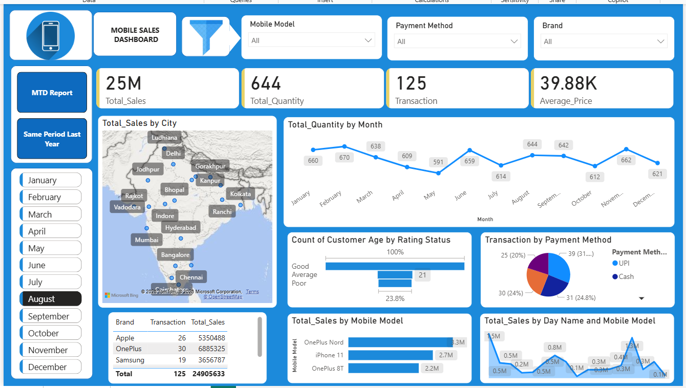

# 📊 Sales Performance Analytics Dashboard | Power BI

## 🚀 Project Overview

This Power BI dashboard provides a comprehensive view of business sales performance through interactive visualizations, KPI tracking, Month-to-Date (MTD) analysis, and Same Period Last Year (SPLY) comparisons.

The dashboard enables stakeholders to monitor business growth, evaluate sales trends, identify performance gaps, and make data-driven decisions.

---

## 🎯 Business Problem

Organizations often struggle to monitor sales performance across different periods and compare current performance with historical trends.

This dashboard addresses these challenges by:

* Tracking key business KPIs
* Monitoring Month-to-Date performance
* Comparing results with the same period from the previous year
* Identifying growth opportunities and performance gaps
* Supporting strategic business decisions

---

## 📌 Dashboard Pages

### 1️⃣ Executive Dashboard

Provides a high-level overview of business performance.

**Key Features**

* KPI Summary Cards
* Sales Overview
* Revenue Analysis
* Trend Monitoring
* Interactive Filtering
* Performance Tracking

---

### 2️⃣ MTD (Month-To-Date) Report

Tracks current month performance.

**Insights Included**

* Current Month Sales
* Month-to-Date Revenue
* Performance Against Targets
* Category Analysis
* Sales Trends

---

### 3️⃣ Same Period Last Year (SPLY)

Compares current performance against historical data.

**Insights Included**

* Current Year vs Previous Year
* Growth Percentage
* Revenue Comparison
* Trend Analysis
* Performance Benchmarking

---

## 🛠 Tools & Technologies

* Power BI Desktop
* Power Query
* DAX
* Data Modeling
* Data Visualization
* Business Intelligence

---

## 📈 Key Performance Indicators

The dashboard tracks metrics such as:

* Total Sales
* Revenue
* Growth %
* MTD Performance
* Previous Year Performance
* Variance Analysis
* Business Trends

---

## 📊 Business Insights

Using this dashboard, users can:

* Identify revenue trends.
* Compare current and historical performance.
* Analyze month-to-date progress.
* Detect growth opportunities.
* Monitor business KPIs in real time.
* Improve decision-making through data visualization.

---

## 🔍 Dashboard Features

✅ Interactive Filters

✅ Dynamic KPI Cards

✅ MTD Analysis

✅ SPLY Comparison

✅ Trend Analysis

✅ Performance Monitoring

✅ Business Intelligence Reporting

---

## 📸 Dashboard Preview

### Main Dashboard



---

## 📂 Repository Structure

```text
Sales-Performance-Dashboard/
│
├── Sales Dashboard.pbix
├── dashboard.png
├── README.md
└── Dataset.xlsx
```

---

## 💡 Future Enhancements

* Forecasting using Time Series Analysis
* Advanced DAX Measures
* Drill-through Analysis
* Mobile Optimized Reports
* Automated Data Refresh
* AI-Based Insights

---

## 👨‍💻 Author

**Uday Yadav**

Aspiring Data Analyst | Power BI Developer | SQL | Excel | Data Visualization

If you found this project useful, feel free to ⭐ the repository.
